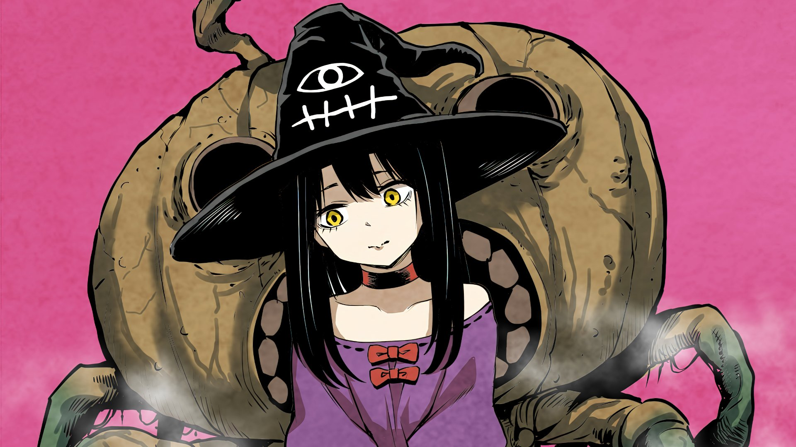

<h1 align="center">Hey 👋 I'm Minh</h1>

  <strong>Software Developer | System-Oriented Builder</strong>

  

  

## 🛠 Tech Stack

  

## 💫 About Me

I’m a **Software Developer** who enjoys turning complex ideas into **working systems** (≧◡≦) ♡  
My experience spans **Backend Development, IoT Integration, Media Streaming, and Computer Vision**.

- 🔭 **Currently building:** Real-time IoT systems & AI-powered vision apps ⚙️
- 🏗 **Mindset:** System thinking — from sensors → backend → UI 🧠
- ☁ **Infrastructure:** Ubuntu servers, Dockerized services, media streaming 📡
- 🎯 **Goal:** Ship end-to-end products that actually work in production 💪

## 📊 GitHub Stats

  

## 🤝 Connect with me

  

  

  

  

  

  

## ❤ Thanks for stopping by

  <i>See you around — keep building cool things ✨ <3</i>

  

